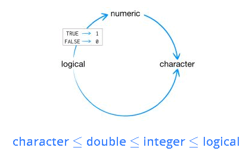

## <b> <font color=SteelBlue face=Arial size=6> Interfaz de RStudio </font> </b>

<p> <font color=SteelBlue face=Arial size=7>  </font> </b>
{width=100%}
</p>

## <b> <font color=SteelBlue face=Arial size=6> Ejecutar código R </font> </b>
* __R como calculadora__
```{r, eval=TRUE}
  5+10

  8/20

  sin(10)
```


## <b> <font color=SteelBlue face=Arial size=6> Instalación de paquetes</font> </b>

* Utilizamos la función (install.packages).
* Se indica el nombre del paquete.
```{r, eval=FALSE}
  install.packages("package_name")
```
* Se indica si se deben instalar o no los paquetes requeridos para que este funcione.
```{r, eval=FALSE}
  install.packages("package_name", dependencies=TRUE)
```
* En el caso que se desee instalar un lista de n paquetes planteamos la siguiente solución:
```{r, eval=FALSE}
  packages <- c("package_1","package_2", ... , "package_n")
  install.packages(packages, dependencies=TRUE)
  # funciones apply
  # sapply(X=packages, FUN=install.packages, dependencies=TRUE)
```

## <b> <font color=SteelBlue face=Arial size=6>Ejemplo</font> </b>

* Instalar el paquete **tidyverse**

```{r, eval=FALSE}
  install.packages("tidyverse", dependencies=TRUE)
```
* Instalar varios paquetes a la vez
```{r, eval=FALSE}
  packages <- c("ggplot2","lubridate","readr")
  install.packages(packages, dependencies=TRUE)
  # funciones apply
  # sapply(X=packages, FUN=install.packages, dependencies=TRUE)
```

<p align="center">
{ width=25% } 
</p>

## <b> <font color=SteelBlue face=Arial size=6>Cargar paquetes</font> </b>
* La función **library** o **require** nos permite cargar un paquete al área de trabajo.
* Lo paquetes se instalan una sola vez y serán cargados cada vez que se inicie una nueva sección. 

```{r, eval=TRUE}
  library(ggplot2)
```
* Cargar varios paquetes
```{r, eval=FALSE}
  packages <- c("ggplot2","lubridate","readr")
  # funciones apply
  # sapply(X=packages, FUN=library, character.only=TRUE)
```
* Conocer que paquetes están cargados
```{r, eval=TRUE}
  (.packages())
```

## <b> <font color=SteelBlue face=Arial size=6>Estructura de Datos Fundamentales</font> </b>
La estructura de los datos se organizan por:

* **Dimensionalidad**
* **Homogeneidad o heterogeneidad**

| N° Dimensiones | Simple | Multiple |
| :------- | :------: | -------: |
| 1 Dimensión   | Vector | List |
| 2 Dimensiones   | Matrix | Dataframe |
| n Dimensiones  | Array | 

## <b> <font color=SteelBlue face=Arial size=6>Generalidades</font> </b>
* Nuevo script: ctrl + shift + n
* Ejecutar selección o linea actual: ctrl + enter
* Insertar simbolo de asignación **<-**: alt + -
```{r}
  a <- 5
```

* Comentar/descomentar: ctrl + shift + c
```{r}
  # Este es un comentario
```

* Crear secciones de código: ctrl + shift + r
* Insertar el operador pipe **%>%**: ctrl + shift + m
```{r, eval=FALSE}
  df %>% select(variable)
```


## <b> <font color=SteelBlue face=Arial size=6>Vectores</font> </b>

* La estructura de datos básica de R son los vectores, estos se dividen en:
    + __Vectores atómicos y Listas__

* Presentan tres propiedades comunes:
    + Tipo (Qué es?). `typeof()`
    + Longitud (Número de elementos) `length()`
    + Atributos (Metadata). `attributes()`

* Para probar que una estructura de datos es un vector (atómico o lista) se utiliza la función:
```{r,eval=FALSE}
  is.vector(x)
```
* `is.vector(x)` retorna `TRUE` si `x` es un vector atómico o una lista.

## <b> <font color=SteelBlue face=Arial size=6> Vectores atómicos </font> </b>

* Los elementos de un vector atómico son del __mismo tipo__ (tipos comunes):
    + logical
    + integer
    + double (comunmente llamados numeric)
    + character

* Un vector es creado mediante la función `c()`, e ingresamos a la _i-ésima_ componente con `x[i]`

```{r}
  dbl_var <- c(1, 2, -1) 
  int_var <- c(3L, 7L, 1L) # con el sufijo L se declaran números enteros
  log_var <- c(FALSE, TRUE, F, T) # TRUE y FALSE (T, F) se usan para crear vectores lógicos
  chr_var <- c("Source", "Stat", "Lab")
```

```{r, eval=FALSE}
  # tercera componente de dbl_var
  dbl_var[3]
```


```{r}
  c(1, c(2, c(3,4))) ; c(1, 2, 3, 4) # los vectores pueden ser anidados
```

## <b> <font color=SteelBlue face=Arial size=6> Tipos de Vectores atómicos </font> </b>

* Dado un vector se puede determinar su tipo con `typeof()` o verificar un tipo específico con una "is" función:
    + `is.character()`
    + `is.double()`
    + `is.integer()`
    + `is.logical()`
```{r}
  dbl_var <- c(1, 2, -1)
  typeof(dbl_var)
  is.double(dbl_var)
```


## <b> <font color=SteelBlue face=Arial size=6> Tipos de Vectores atómicos </font> </b>

```{r}
  dbl_var <- c(1, 2, -1)
  is.atomic(dbl_var)
```

```{r}
  int_var <- c(3L, 7L, 1L)
  typeof(int_var)
  is.integer(int_var)
  is.atomic(int_var)
```

## <b> <font color=SteelBlue face=Arial size=6> Tipos de Vectores atómicos </font> </b>

* __`is.numeric()` retorna `TRUE` para vectores double e integer__

```{r}
  dbl_var <- c(1, 2, -1)
  is.numeric(dbl_var)
  int_var <- c(3L, 7L, 1L)
  is.numeric(int_var)
```

## <b> <font color=SteelBlue face=Arial size=7> Coerción </font> </b>
* Los elementos de un vector son del mismo tipo, es por eso que si combinamos tipos diferentes, serán coercionados al tipo más flexible dado por la jerarquía:

<p align="center">
{ width=30% } 
</p>

```{r}
  x <- c("Hola", 1, TRUE)
  typeof(x)
```


## <b> <font color=SteelBlue face=Arial size=7> Coerción </font> </b>

* Se usa las funciones **"as"** para coercionar un vector a un determinado tipo: `as.character(), as.double(), as.integer(), as.logical()` 

```{r}
  x <- c(FALSE, TRUE, FALSE, TRUE) 
  as.numeric(x) # TRUE coerciona a 1 y FALSE a 0
  sum(x) # número total de TRUEs 
  mean(x) # proporción de TRUEs
```


## <b> <font color=SteelBlue face=Arial size=7> Listas </font> </b>
* Una lista puede contener elementos de cualquier tipo. 
* Para construir una lista se utiliza la función `list()` en lugar de `c()`. 
```{r}
  x <- list(1:3, c("Source", "Stat", "Lab"), c(TRUE, FALSE), c(1.3, 4.5))
  str(x)
  is.atomic(x)
```

```{r, eval=FALSE}
  # coercionamos un objeto a una lista
  as.list(c("Hola", 4, 0.5))
```

## <b> <font color=SteelBlue face=Arial size=7> Listas </font> </b>
```{r}
  x <- list(1:3, c("Source", "Stat", "Lab"), c(TRUE, FALSE), c(1.3, 4.5))
  typeof(x)
  # probamos si x es una lista
  is.list(x)
  # pasamos a vector considerando las reglas de coerción
  unlist(x)
```

## <b> <font color=SteelBlue face=Arial size=7> Listas </font> </b>

* Una lista es un __vector recursivo__, es decir una lista puede contener otra lista (diferencia principal con los __vectores atómicos__)

```{r}
  x <- list(list(list("Source", "Stat")))
  str(x)
```


```{r}
  # son equivalentes. un vector no puede contener otro vector
  c(1, c(2, c(3,4)))  ;  c(1, 2, 3, 4)
```

## <b> <font color=SteelBlue face=Arial size=7> Elementos de una lista </font> </b>

* Para acceder al elemento `i` de la lista se utiliza `x[i]`, en cambio para acceder al objeto que contiene el elemento `i` se utiliza `x[[i]]` o `x$nomb_obj`.

```{r}
  x <- list(1:3, c("Source", "Stat", "Lab"), nomb_obj=c(TRUE, FALSE), c(1.3, 4.5))
  x[4]
  x[[4]]
  x$nomb_obj
```

## <b> <font color=SteelBlue face=Arial size=7> Matrices </font> </b>

  Una matriz es un vector con el atributo dimensión dim. El atributo dim es un vector de longitud 2:c(nrow, ncol). Se construye por columnas por defecto (byrow=FALSE).

```{r}
  mtx <- matrix (1:12,nrow=3, ncol=4, byrow=FALSE)
  mtx
```

```{r}
  mtx <- matrix (1:12,nrow=3, ncol=4, byrow=TRUE)
  mtx
```

## <b> <font color=SteelBlue face=Arial size=7> Elementos de una matriz </font> </b>

Columnas dos y cuatro

```{r}

  mtx <- matrix (1:12, nrow=3, ncol=4, byrow=FALSE)
  mtx[,c(2,4)]
  # Filas 2 y 3
  mtx[c(2,3),]
```

## <b> <font color=SteelBlue face=Arial size=7> Array </font> </b>
  Un array es la generalización de una matriz de dos dimensiones al caso multidimensional. Su definición general
es de la forma:

+ array(datos, dimensiones)
```{r}
  array(1:12,c(2,3,2))
```

## <b> <font color=SteelBlue face=Arial size=7> Array </font> </b>

Un ejemplo más ilustrativo:

Vamos a crear un array con la edad media, el peso medio y la estatura media para hombres y mujeres de dos poblaciones: Sur y Norte:
```{r}
  x<-array(c(45,46,65,55,170,167,48,49,68,56,169,165),c(2,3,2))
  dimnames(x)<-list(c("hombres","mujeres"),c("edad","peso","altura"),c("Sur","Norte"))
  x
```

## <b> <font color=SteelBlue face=Arial size=7> Elementos de un array </font> </b>

Para acceder a los elementos del array:

```{r}
  dimnames(x)# Nombre de las dimensiones del array
```

```{r}
  x[,,"Sur"] # Datos para la población "Sur"
```

## <b> <font color=SteelBlue face=Arial size=7> Dataframe </font> </b>

  + Es una lista en la cual todos los elementos tienen la misma longitud.
  
  + A diferencia de las matrices, pueden almacenar vectores atómicos de cualquier tipo.
  
  + Presenta varios atributos adicionales class, rownames, names.
  
  + Es la estructura de datos más utilizada para almacenar data tabulada.

<p align="center">
{ width=40% } 
</p>

## <b> <font color=SteelBlue face=Arial size=7> Dataframe </font> </b>

* Para crear un data frame se utiliza la función data.frame(). Con los siguientes vectores atómicos:
```{r}
  dbl_vec <- c(1, 2, 3)
  chr_vec <- c("R", "S", "T")
  log_vec <- c(TRUE, FALSE, TRUE)
```

Creamos el data frame df:
```{r}
  df <- data.frame(dbl_vec, chr_vec, log_vec)
  df
```

## <b> <font color=SteelBlue face=Arial size=7> Elementos de un dataframe </font> </b>

* Para crear un data frame se utiliza la función data.frame(). Con los siguientes vectores atómicos:

```{r}
  nomb <- c("John", "Paul", "George", "Ringo")
  nac <- c(1940, 1941, 1943, 1940)
  instr <- c("guitar", "bass", "guitar", "drums")
  df <- data.frame(nomb, nac, instr)
  df[2, c(2,3)] #Mediante df[i, j] se obtiene la componente i, j del data frame.
```

## <b> <font color=SteelBlue face=Arial size=7> Elementos de un dataframe </font> </b>

```{r}
  df[2, 2] # componente 2, 2
  df[3, 1] # componente 3, 1
  df[3, ] # fila 3
  df[ , 3]=="guitar" # columna 3 de df igual a "guitar"
```

